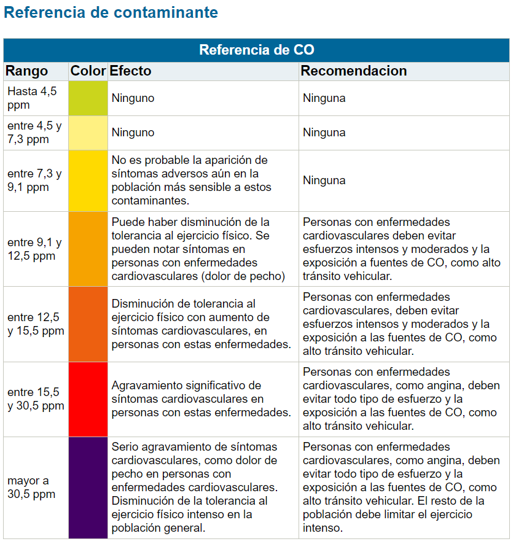
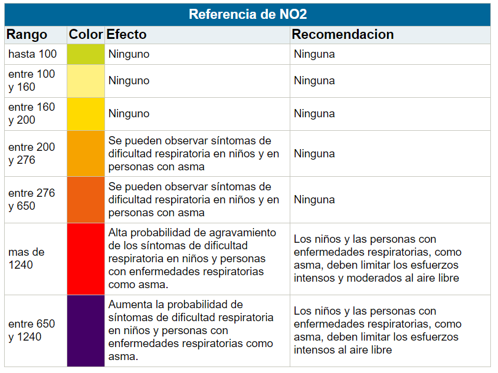
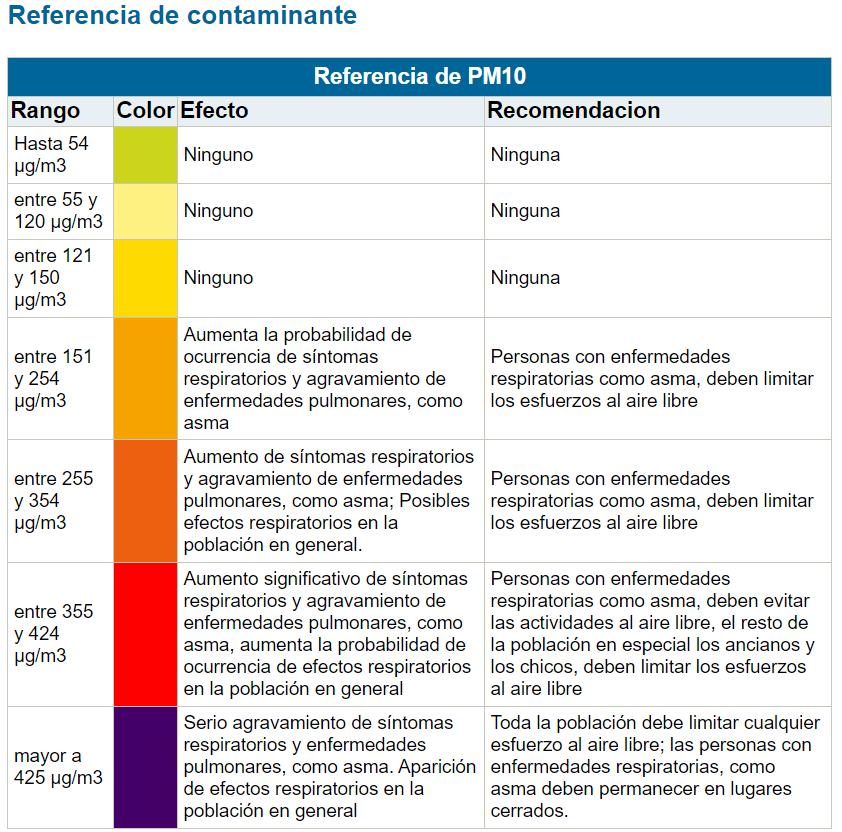
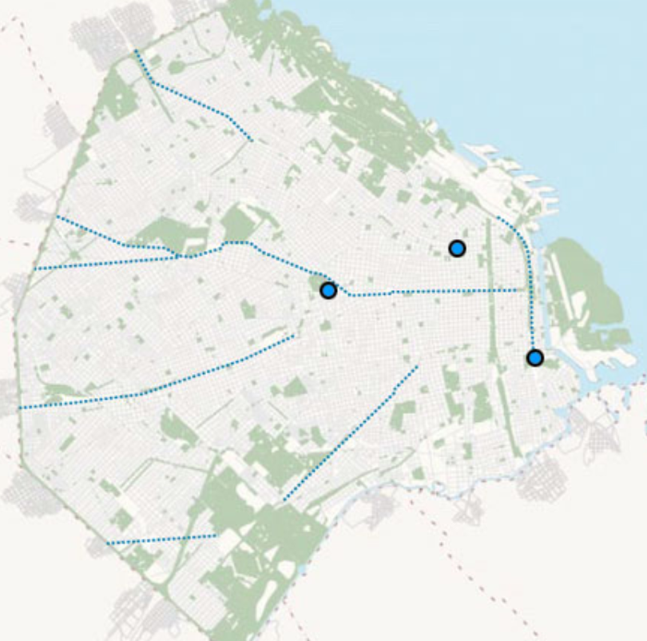

# air-quality-tests
Working with air quality datasets from many sources. Tools: Excel, .NET 8, Visual Studio

## About the dataset

### Sources
**Official**
- [Buenos Aires Data - Calidad de Aire](https://data.buenosaires.gob.ar/dataset/calidad-aire)
- [Calidad del Aire | Buenos Aires Ciudad - Gobierno de la Ciudad Autónoma de Buenos Aires](https://buenosaires.gob.ar/laboratorio-ambiental/calidad-del-aire)
- [Estación Parque Centenario | Buenos Aires Ciudad - Gobierno de la Ciudad Autónoma de Buenos Aires](https://buenosaires.gob.ar/calidad-del-aire/estacion-parque-centenario)
- [Red de Monitoreo - Buenos Aires Ciudad - Calidad Ambiental](https://buenosaires.gob.ar/areas/med_ambiente/apra/calidad_amb/red_monitoreo/mapa.php?menu_id=34233)
- [Obtener contaminantes por día por lugar - Buenos Aires Ciudad - Calidad Ambiental](https://buenosaires.gob.ar/areas/med_ambiente/apra/calidad_amb/red_monitoreo/index.php?estacion=1&menu_id=34234)

**External providers**
- [Índice de Calidad del Aire (Buenos Aires): Contaminación del Aire en Tiempo Real (aqi.in)](https://www.aqi.in/es/dashboard/argentina/buenos-aires)

**Noticias**
- [Incendios y calidad del aire: Un vínculo inquietante en la Ciudad de Buenos Aires | Sobre La Tierra (uba.ar)](https://sobrelatierra.agro.uba.ar/incendios-y-calidad-del-aire-un-vinculo-inquietante-en-la-ciudad-de-buenos-aires/)
- [Especialistas de la UBA alertan por la calidad del aire en la Ciudad (ambito.com)](https://www.ambito.com/informacion-general/especialistas-la-uba-alertan-la-calidad-del-aire-la-ciudad-n5795059)

### Data characteristics
**Ficha de contaminante - CO.**

**Ficha de contaminante - NO2.**

**Ficha de contaminante - PM10.**

**Fuentes recolectoras de datos.**

### Transforming data
- [Calculating AQI (Air Quality Index) Tutorial (kaggle.com)](https://www.kaggle.com/code/rohanrao/calculating-aqi-air-quality-index-tutorial)
- **Add missing fields**: _season_ y _"color" foreach contaminant_ (based on previously defined effects).

### Analysis approach
| **Combination** | **Approach** | **Use Case** | **Benefits**  |
|-----------------------------------------------|------------------------------------------------------------------------------------------------|-----------------------------------------------------------------|---------------------------------------------------------------------|
| **Clustering + Decision Trees** | Cluster by pollutant levels across locations, apply decision trees to predict air quality.| Group air quality patterns by time/location and predict poor air quality. | Reveals patterns and creates predictive rules for specific clusters. |
| **Decision Trees + Association Rules**  | Use decision trees to identify key pollutants, apply association rules to find pollutant co-occurrences. | Identify key pollutants driving poor air quality, and find co-occurrence patterns. | Uncovers important pollutants and frequent co-occurrences.  |
| **Clustering + Association Rules** | Cluster based on pollutant levels at different locations, then apply association rules within each cluster. | Understand pollutant combinations that spike together across locations. | Targeted pattern discovery for specific clusters of air quality data. |
| **Clustering + Decision Trees + Association Rules** | Cluster data, use decision trees to predict air quality, and mine association rules within clusters. | Comprehensive air quality analysis across time and locations. | Multi-faceted approach combining segmentation, prediction, and patterns. |
| **Association Rules Informed by Decision Trees** | Use decision trees to find key pollutants, then apply association rules on these pollutants.  | Focus on critical pollutants and discover related pollutant patterns. | Reduces complexity by focusing on the most important features. |

## Architecture Records
### 1. On DB Injection
#### Context
Based on this file for a current sample: [aspire-samples/samples/AspireShop/AspireShop.BasketService/AspireShop.BasketService.csproj at main · dotnet/aspire-samples (github.com)](https://github.com/dotnet/aspire-samples/blob/main/samples/AspireShop/AspireShop.BasketService/AspireShop.BasketService.csproj)

#### Decision
I will inject the DB from the `AirQualityApp.ApiService` project

### 2. Processing Application
#### Context
Based on experience, the main objective of the app will be exposing through an API/web frontend, the consumed/processed dataset

#### Decision
The architecture will be like:

### 3. CSV Reading approach
#### Context
My options are:
1. Manual parsing.
2. `JoshClose/CsvHelper` NuGet Package.

#### Decision
We are using this NuGet package: [`JoshClose/CsvHelper`: Library to help reading and writing CSV files (github.com)](https://github.com/JoshClose/CsvHelper)
[CsvHelper Getting started](https://joshclose.github.io/CsvHelper/getting-started/)
